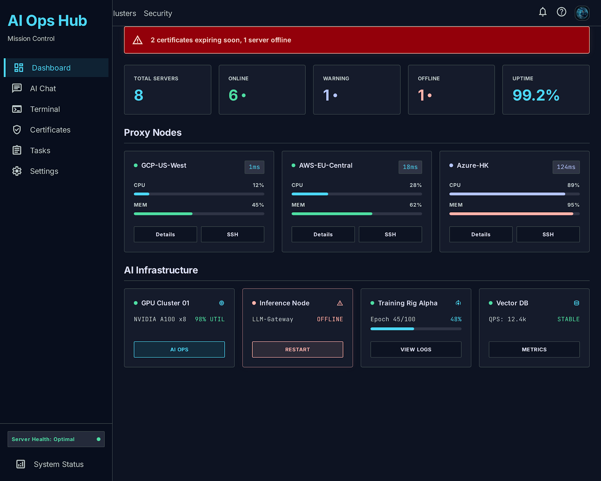
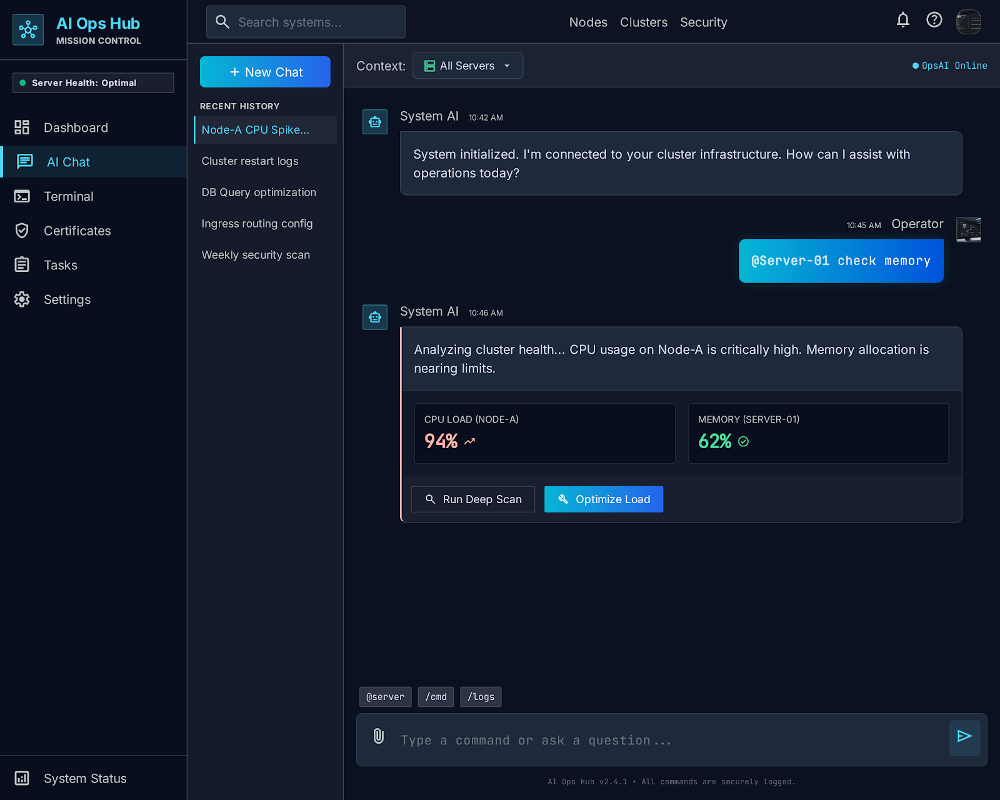
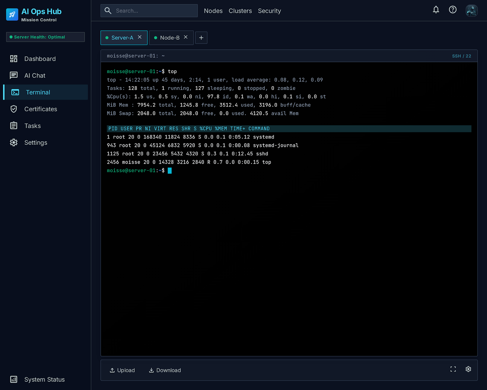
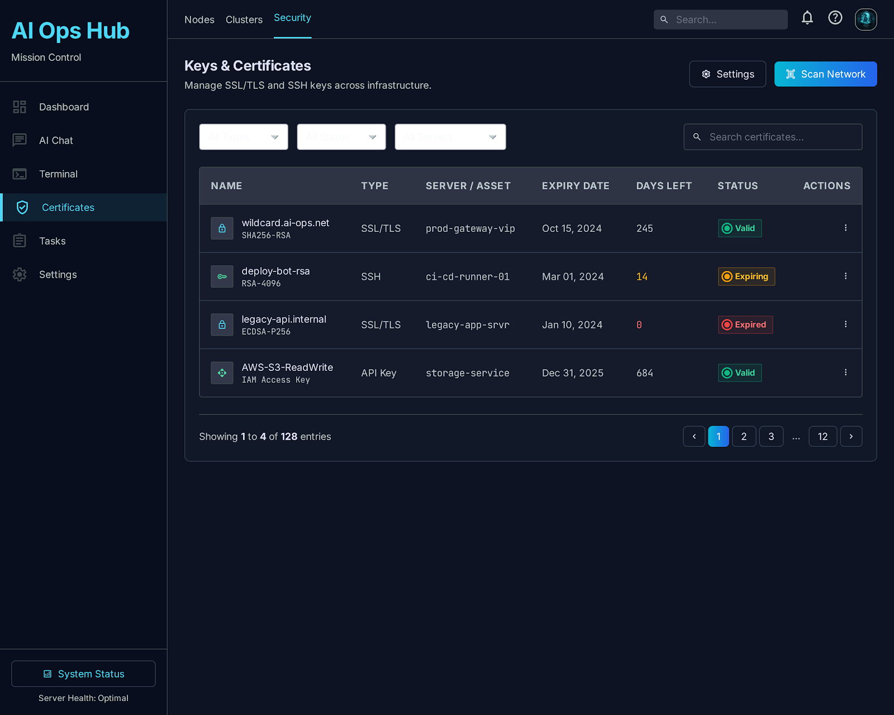
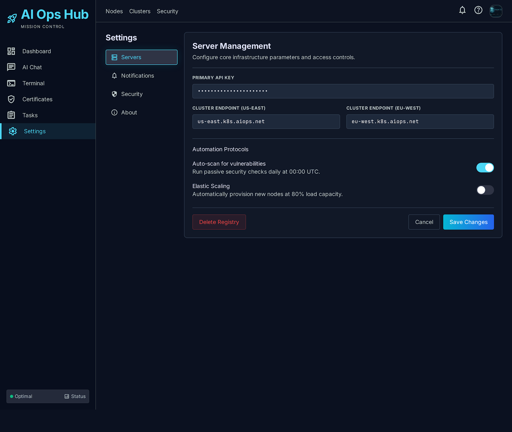

# ⚡ AI Ops Hub

**AI-Native Server Management Platform** — Manage your entire infrastructure through natural language.

[](https://opensource.org/licenses/MIT)
[](https://vuejs.org/)
[](https://nodejs.org/)
[](https://www.typescriptlang.org/)
[](https://tailwindcss.com/)

---

##  Screenshots

### Dashboard — Real-time Server Overview



Real-time CPU, memory, disk metrics across all servers with color-coded status indicators.

### AI Chat — Natural Language Operations



Execute commands via natural language — *"Check memory on server-02"* or *"Why is my app slow?"*

### Web SSH — Browser-based Terminal



Browser-based terminal with multi-tab support, no password memorization needed.

### Certificate Management



Auto-scan SSH keys, SSL certs, and domain expiry with proactive alerts.

### Settings



Server management, notification configuration, and security settings.

## ✨ Features

### 🎯 Core Capabilities

| Feature | Description |
|---------|-------------|
| **Unified Dashboard** | Real-time CPU, memory, disk metrics across all servers with color-coded status indicators |
| **AI Chat Operations** | Execute commands via natural language — *"Check memory on server-02"* or *"Why is my app slow?"* |
| **Web SSH Terminal** | Browser-based terminal with multi-tab support, no password memorization needed |
| **Certificate Management** | Auto-scan SSH keys, SSL certs, and domain expiry with proactive alerts (30/7/1 days) |
| **Real-time Monitoring** | Netdata integration for second-level precision performance metrics |
| **Smart Alerts** | Feishu/Telegram webhook notifications for anomalies and expiring certificates |

### 🎨 Design System

- **Theme**: Deep Space Dark (#0B1120 background)
- **Accent**: Cyan (#06B6D4) for primary actions
- **Status Colors**: Green (online), Amber (warning), Red (offline)
- **Typography**: Inter (UI) + JetBrains Mono (code/terminal)
- **Animations**: Card hover lift, status dot pulse, page fade-in

---

## 🏗️ Architecture

```
┌─────────────────────────────────────────────────────────────────
│                        Frontend (Vue 3)                         │
│  ──────────┐  ┌──────────  ┌──────────┐  ┌──────────────┐  │
│  │Dashboard │  │ AI Chat  │  │ Terminal │  │ Certificates │  │
│  ──────────┘  └──────────┘  └──────────┘  └──────────────┘  │
└────────────────────────┬────────────────────────────────────────┘
                         │ REST API + WebSocket
┌────────────────────────▼────────────────────────────────────────┐
│                       Backend (Node.js)                          │
│  ┌──────────┐  ┌──────────  ┌──────────┐  ┌──────────────┐  │
│  │Servers   │  │ SSH      │  │ AI Chat  │  │ Certificates │  │
│  │CRUD      │  │Gateway   │  │Proxy     │  │Scanner       │  │
│  ──────────┘  └──────────┘  └──────────┘  └──────────────┘  │
└────────────────────────────────────────────────────────────────┘
                         │
┌────────────────────────▼────────────────────────────────────────
│                      Infrastructure Layer                        │
│  ──────────┐  ┌──────────  ┌──────────┐  ┌──────────────┐  │
│  │Server-01 │  │Server-02 │  │Server-03 │  │Server-N      │  │
│  │(GCP)     │  │(AWS)     │  │(Azure)   │  │(...)         │  │
│  └──────────  └──────────┘  └──────────┘  └──────────────┘  │
└─────────────────────────────────────────────────────────────────┘
```

---

## 🚀 Quick Start

### Prerequisites

- Node.js >= 22
- npm >= 10
- Git

### Installation

```bash
# 1. Clone the repository
git clone https://github.com/moisse/ai-ops-hub.git
cd ai-ops-hub

# 2. Install backend dependencies
cd backend
npm install

# 3. Install frontend dependencies
cd ../frontend
npm install

# 4. Configure environment variables
cp backend/.env.example backend/.env
# Edit backend/.env with your configuration

# 5. Start development servers
cd backend && npm run dev      # API runs on http://localhost:3000
cd ../frontend && npm run dev  # UI runs on http://localhost:5173
```

### Production Deployment

```bash
# Build frontend
cd frontend
npm run build

# Start backend in production
cd ../backend
NODE_ENV=production npm start
```

---

## 📁 Project Structure

```
ai-ops-hub/
├── frontend/                 # Vue 3 + TypeScript SPA
│   ├── src/
│   │   ├── components/       # Reusable UI components
│   │   │   ├── ServerCard.vue
│   │   │   ├── StatCard.vue
│   │   │   ├── Sidebar.vue
│   │   │   └── TopNav.vue
│   │   ├── pages/            # Route pages
│   │   │   ├── Dashboard.vue
│   │   │   ├── AIChat.vue
│   │   │   ├── Terminal.vue
│   │   │   ├── Certificates.vue
│   │   │   └── Settings.vue
│   │   ├── stores/           # Pinia state management
│   │   ├── utils/            # API client, helpers
│   │   │   └── api.ts
│   │   ├── App.vue
│   │   ├── main.ts
│   │   ── style.css
│   ├── index.html
│   ├── vite.config.ts
│   ├── tailwind.config.js
│   └── package.json
│
├── backend/                  # Node.js + Express API
│   ├── src/
│   │   ├── routes/           # API route handlers
│   │   │   ├── ssh.ts
│   │   │   └── chat.ts
│   │   └── index.js          # Main entry point
│   ├── data/                 # SQLite database (gitignored)
│   ├── .env.example          # Environment template
│   ── package.json
│
├── docs/                     # Documentation
├── .gitignore
── CHANGELOG.md
├── CONTRIBUTING.md
├── LICENSE
└── README.md
```

---

## 🔌 API Documentation

### Servers

| Method | Endpoint | Description |
|--------|----------|-------------|
| `GET` | `/api/servers` | List all servers |
| `POST` | `/api/servers` | Add new server |
| `GET` | `/api/servers/:id` | Get server details |
| `PUT` | `/api/servers/:id` | Update server |
| `DELETE` | `/api/servers/:id` | Delete server |

### SSH

| Method | Endpoint | Description |
|--------|----------|-------------|
| `POST` | `/api/ssh/connect` | Establish SSH connection |
| `POST` | `/api/ssh/disconnect` | Close SSH connection |
| `POST` | `/api/ssh/execute` | Execute command on server |
| `GET` | `/api/ssh/sessions` | List active sessions |

### AI Chat

| Method | Endpoint | Description |
|--------|----------|-------------|
| `POST` | `/api/chat` | Send message to AI |
| `GET` | `/api/chat/history` | Get conversation history |

### Certificates

| Method | Endpoint | Description |
|--------|----------|-------------|
| `GET` | `/api/certificates` | List all certificates |
| `GET` | `/api/certificates/expiring` | Get expiring soon |

---

## ⚙️ Configuration

### Environment Variables

Copy `backend/.env.example` to `backend/.env` and configure:

```env
# Server Configuration
PORT=3000
NODE_ENV=development

# Database
DATABASE_URL=./data/ai-ops.db

# AI Configuration (Hermes Agent)
HERMES_API_URL=http://localhost:8080
HERMES_API_KEY=your-api-key-here

# Notification Webhooks (Optional)
FEISHU_WEBHOOK_URL=https://open.feishu.cn/open-apis/bot/v2/hook/your-webhook-id
TELEGRAM_BOT_TOKEN=your-telegram-bot-token
TELEGRAM_CHAT_ID=your-chat-id

# JWT Authentication
JWT_SECRET=change-me-in-production
JWT_EXPIRES_IN=7d
```

---

## 🗺️ Roadmap

| Phase | Feature | Status | ETA |
|-------|---------|--------|-----|
| **Phase 1** | MVP Dashboard + Server CRUD | ✅ Done | — |
| **Phase 2** | Web SSH Terminal | ✅ Done | — |
| **Phase 3** | AI Chat Operations | ✅ Done | — |
| **Phase 4** | Netdata Metrics Integration | 🔄 In Progress | 2026-08-12 |
| **Phase 5** | Certificate Auto-scan | ⚪ Planned | — |
| **Phase 6** | Batch Operations + Ansible | ⚪ Planned | — |
| **Phase 7** | Mobile Responsive Layout |  Planned | — |
| **Phase 8** | Docker Compose One-Click Deploy |  Planned | 2026-09-09 |

---

## 🤝 Contributing

We welcome contributions! Please follow these steps:

1. **Fork** the repository
2. **Create** a feature branch (`git checkout -b feat/your-feature`)
3. **Commit** your changes (`git commit -m 'feat: add your-feature'`)
4. **Push** to the branch (`git push origin feat/your-feature`)
5. **Open** a Pull Request

### Commit Convention

We follow [Conventional Commits](https://www.conventionalcommits.org/):

- `feat:` New feature
- `fix:` Bug fix
- `docs:` Documentation changes
- `style:` Code style (formatting, no logic change)
- `refactor:` Code refactoring
- `test:` Test additions or changes
- `chore:` Build process or tooling changes

### Development Workflow

```bash
# Install dependencies
npm install

# Run linter
npm run lint

# Run tests (when available)
npm test

# Build for production
npm run build
```

---

## 🔒 Security

- **SSH keys** are never stored in the database — only file paths
- **All API endpoints** require JWT authentication (planned)
- **Sensitive operations** (delete, restart, deploy) require explicit confirmation
- **Audit log** records every command execution
- **`.env` files** are gitignored — use `.env.example` as template

### Security Best Practices

1. Change `JWT_SECRET` in production
2. Use strong passwords for database
3. Enable HTTPS in production
4. Regularly update dependencies
5. Monitor audit logs for suspicious activity

---

##  Tech Stack

| Layer | Technology | Purpose |
|-------|-----------|---------|
| **Frontend Framework** | Vue 3.5 | Reactive UI |
| **Language** | TypeScript 5.6 | Type safety |
| **Styling** | Tailwind CSS 4.0 | Utility-first CSS |
| **Build Tool** | Vite 6.0 | Fast HMR |
| **State Management** | Pinia 2.2 | Vue store |
| **Charts** | ECharts 5.5 | Data visualization |
| **Terminal** | xterm.js 5.5 | Web terminal emulator |
| **Icons** | Material Symbols | UI iconography |
| **Fonts** | Inter + JetBrains Mono | UI + code typography |
| **Backend Runtime** | Node.js 22 | JavaScript runtime |
| **Web Framework** | Express 4.21 | HTTP server |
| **Database** | SQLite (better-sqlite3) | Lightweight persistence |
| **SSH Client** | ssh2 1.15 | Server connections |

---

## 📝 License

This project is licensed under the MIT License — see the [LICENSE](LICENSE) file for details.

---

## 🙏 Acknowledgments

- Design system generated with [Stitch](https://stitch.withgoogle.com/)
- Terminal emulation powered by [xterm.js](https://xtermjs.org/)
- Charts by [Apache ECharts](https://echarts.apache.org/)
- Icons from [Material Symbols](https://fonts.google.com/icons)
- Fonts by [Google Fonts](https://fonts.google.com/)

---

## 📧 Contact

- **GitHub Issues**: [Report bugs or request features](https://github.com/moisse/ai-ops-hub/issues)
- **Discussions**: [Join the conversation](https://github.com/moisse/ai-ops-hub/discussions)

---

**Made with ❤️ by Moisse Li**
